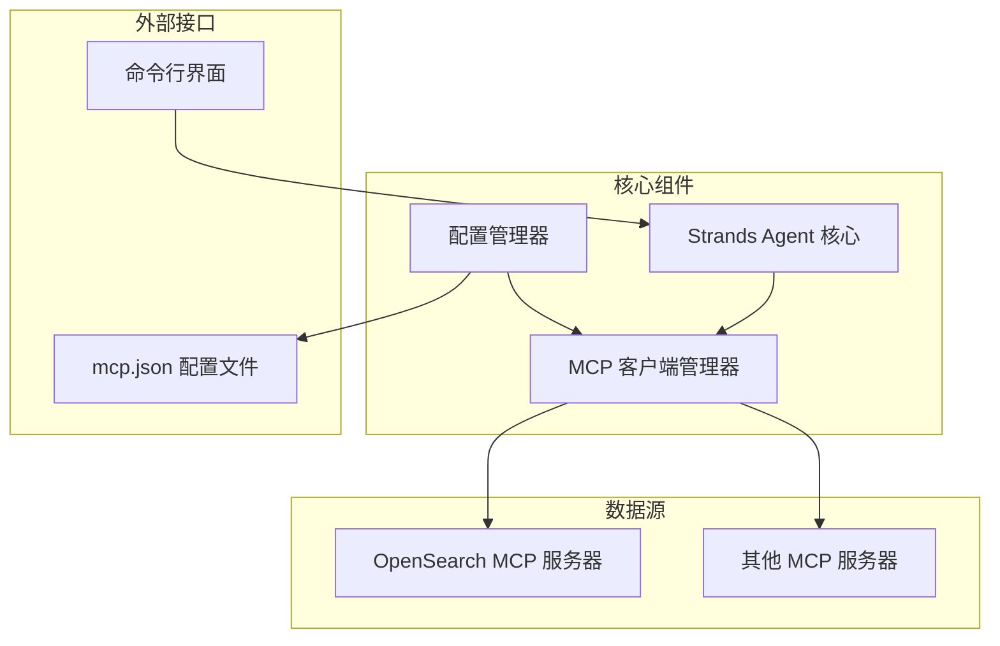

# Design Document

## Overview

日志分析助手是一个基于 Strands Agents SDK 的命令行工具，通过 MCP 协议连接到数据源（如 OpenSearch），使用自然语言处理来分析业务日志。系统采用模块化设计，包含配置管理、MCP 客户端、智能体核心和命令行界面等组件。

## Architecture



## Components and Interfaces

### 1. 主应用程序 (main.py)
**职责：** 应用程序入口点，初始化所有组件并启动命令行界面

**接口：**
- `main()`: 主函数，处理启动逻辑
- `setup_logging()`: 配置日志系统
- `graceful_shutdown()`: 优雅关闭处理

### 2. 配置管理器 (config_manager.py)
**职责：** 读取和验证 mcp.json 配置文件

**接口：**
- `load_mcp_config(config_path: str) -> Dict`: 加载 MCP 配置
- `validate_config(config: Dict) -> bool`: 验证配置格式
- `get_enabled_servers(config: Dict) -> List[Dict]`: 获取启用的服务器列表

**数据结构：**
```python
MCPServerConfig = {
    "command": str,
    "args": List[str],
    "env": Dict[str, str],
    "disabled": bool,
    "autoApprove": List[str]
}
```

### 3. MCP 客户端管理器 (mcp_manager.py)
**职责：** 管理与 MCP 服务器的连接和工具获取

**接口：**
- `initialize_clients(server_configs: List[Dict]) -> List[MCPClient]`: 初始化 MCP 客户端
- `get_all_tools() -> List[Tool]`: 获取所有可用工具
- `health_check() -> Dict[str, bool]`: 检查所有连接状态
- `cleanup()`: 清理资源

### 4. 日志分析智能体 (log_analyzer_agent.py)
**职责：** 核心智能体，处理自然语言查询并分析日志

**接口：**
- `create_agent(tools: List[Tool]) -> Agent`: 创建配置好的智能体
- `analyze_query(query: str) -> str`: 处理用户查询并返回分析结果

**系统提示设计：**
```
你是一个专业的日志分析助手，专门分析业务日志数据。

核心能力：
1. 理解用户的自然语言查询意图
2. 使用 MCP 工具查询日志数据源
3. 分析日志数据并识别模式、趋势和异常
4. 生成清晰易懂的文本摘要

分析重点：
- 业务指标和 KPI
- 用户行为模式
- 系统性能趋势
- 异常和错误模式
- 时间序列分析

输出格式：
- 使用结构化的文本摘要
- 突出显示关键发现
- 提供具体的数值和百分比
- 包含时间范围和数据来源说明
```

### 5. 命令行界面 (cli_interface.py)
**职责：** 处理用户交互和命令行界面

**接口：**
- `start_interactive_mode(agent: Agent)`: 启动交互模式
- `display_welcome_message()`: 显示欢迎信息
- `handle_user_input(input_text: str) -> bool`: 处理用户输入
- `display_result(result: str)`: 显示分析结果

## Data Models

### 查询上下文
```python
@dataclass
class QueryContext:
    user_query: str
    timestamp: datetime
    session_id: str
    available_tools: List[str]
```

### 分析结果
```python
@dataclass
class AnalysisResult:
    summary: str
    key_findings: List[str]
    metrics: Dict[str, Any]
    time_range: Tuple[datetime, datetime]
    data_sources: List[str]
```

## Error Handling

### 1. 配置错误处理
- **mcp.json 不存在**: 提供示例配置文件和设置指导
- **配置格式错误**: 详细的验证错误信息
- **服务器配置无效**: 跳过无效配置并记录警告

### 2. MCP 连接错误处理
- **连接失败**: 重试机制和降级策略
- **工具不可用**: 优雅降级，使用可用工具
- **超时处理**: 设置合理的超时时间和用户提示

### 3. 查询处理错误
- **查询解析失败**: 请求用户澄清查询意图
- **数据源无响应**: 提供替代数据源或缓存结果
- **分析失败**: 返回部分结果和错误说明

## Testing Strategy

第一个版本将专注于核心功能实现，暂不包含完整的测试套件。后续版本将添加单元测试和集成测试。

## Performance and Security Considerations

第一个版本将专注于功能实现，性能优化和安全加固将在后续版本中完善。当前版本将包含基本的错误处理以确保系统稳定性。