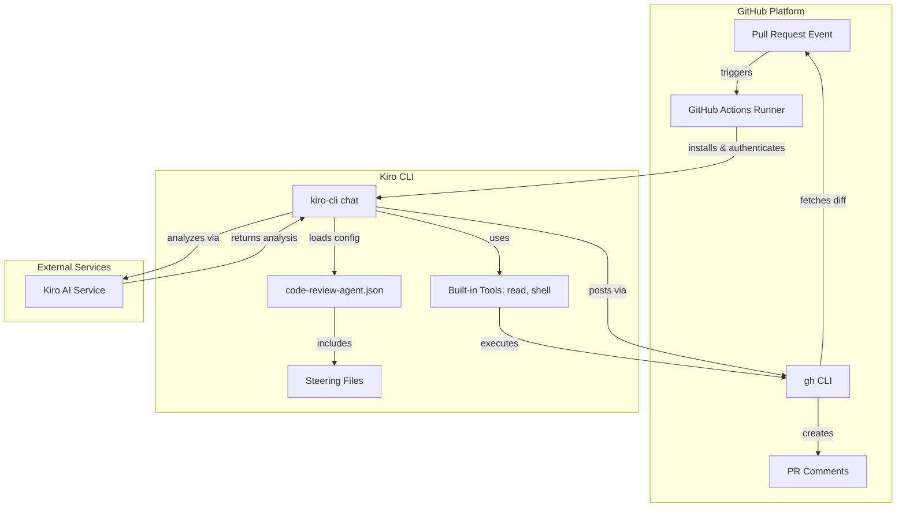
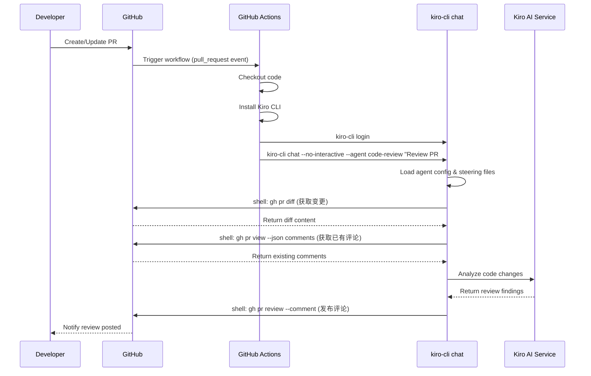
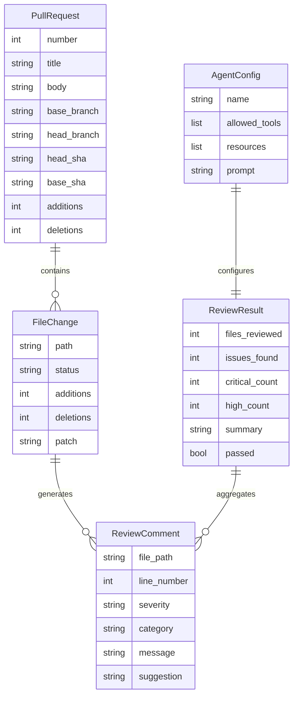
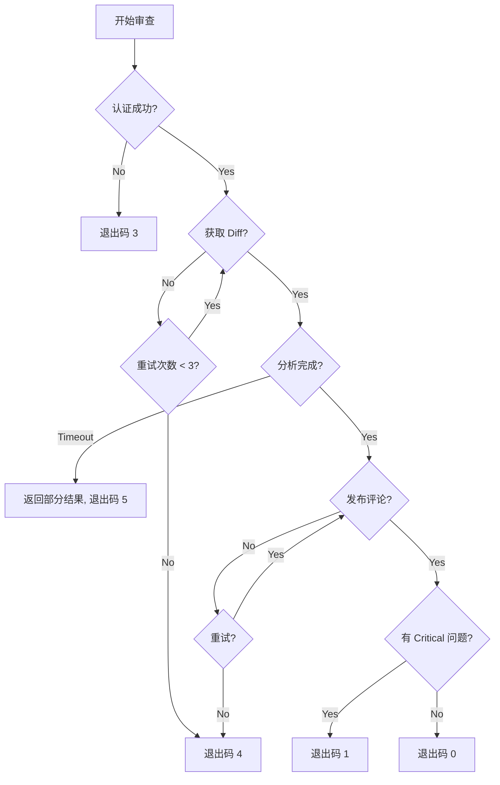

# Design Document: Kiro CLI GitHub Code Review Integration

## Overview

本设计文档描述了将 Kiro CLI 集成到 GitHub Actions CI/CD 流程中实现自动化代码审查的技术方案。

核心实现思路：
1. 创建专用的 `code-review-agent.json` 配置文件定义审查行为和权限
2. 使用 Kiro CLI 的 steering 功能提供审查规范和项目上下文
3. 通过 `kiro-cli chat --no-interactive --agent code-review` 执行非交互式审查
4. 使用 `gh` CLI 工具与 GitHub API 交互，获取 diff 并发布评论
5. 在 GitHub Actions 中编排整个流程

## Architecture



### 系统流程



## Components and Interfaces

### 1. GitHub Actions Workflow

GitHub Actions 工作流配置，定义触发条件和执行步骤。

```yaml
# .github/workflows/kiro-codereview.yml
name: Kiro Code Review

on:
  pull_request:
    types: [opened, synchronize, reopened, ready_for_review]
    branches: [main, develop]

jobs:
  code-review:
    runs-on: ubuntu-latest
    permissions:
      contents: read
      pull-requests: write
    
    steps:
      - name: Checkout repository
        uses: actions/checkout@v4
        with:
          fetch-depth: 0
          ref: ${{ github.event.pull_request.head.sha }}
      
      - name: Install Kiro CLI
        run: |
          curl -fsSL https://cli.kiro.dev/install | bash
          echo "$HOME/.kiro/bin" >> $GITHUB_PATH
      
      - name: Authenticate Kiro CLI
        env:
          KIRO_API_KEY: ${{ secrets.KIRO_API_KEY }}
        run: |
          # 使用 API Key 或 device flow 认证
          kiro-cli login --use-device-flow || echo "Using API key auth"
      
      - name: Run Code Review
        env:
          GH_TOKEN: ${{ github.token }}
          GITHUB_REPOSITORY: ${{ github.repository }}
          PR_NUMBER: ${{ github.event.pull_request.number }}
          PR_HEAD_SHA: ${{ github.event.pull_request.head.sha }}
          PR_BASE_SHA: ${{ github.event.pull_request.base.sha }}
        run: |
          kiro-cli chat --no-interactive --agent code-review \
            --trust-tools "read,shell" \
            "Please review PR #${PR_NUMBER} in ${GITHUB_REPOSITORY}. 
             Head SHA: ${PR_HEAD_SHA}, Base SHA: ${PR_BASE_SHA}.
             Use 'gh pr diff ${PR_NUMBER}' to get the changes and 
             'gh pr review ${PR_NUMBER} --comment --body <review>' to post your review."
```

### 2. Code Review Agent Configuration

自定义 Agent 配置文件，定义审查行为、工具权限和提示词。

```json
// .kiro/agents/code-review.json
{
  "name": "code-review",
  "description": "Automated code review agent for GitHub Pull Requests",
  "prompt": "file://./prompts/code-review-prompt.md",
  "tools": [
    "read",
    "shell"
  ],
  "allowedTools": [
    "read",
    "shell"
  ],
  "toolsSettings": {
    "shell": {
      "allowedCommands": [
        "gh pr diff*",
        "gh pr view*",
        "gh pr review*",
        "gh pr comment*",
        "git diff*",
        "git log*",
        "git show*",
        "cat*",
        "head*",
        "tail*",
        "grep*",
        "find*",
        "wc*"
      ],
      "deniedCommands": [
        "gh pr merge*",
        "gh pr close*",
        "git push*",
        "git commit*",
        "rm*",
        "mv*"
      ]
    }
  },
  "resources": [
    "file://README.md",
    "file://.kiro/steering/code-review-rules.md",
    "file://CONTRIBUTING.md",
    "file://.eslintrc*",
    "file://.prettierrc*",
    "file://pyproject.toml"
  ],
  "hooks": {
    "agentSpawn": [
      {
        "command": "git status --porcelain",
        "timeout_ms": 5000
      }
    ]
  },
  "model": "claude-sonnet-4"
}
```

### 3. Code Review Prompt

审查提示词文件，定义 AI 的审查行为和输出格式。

```markdown
<!-- .kiro/agents/prompts/code-review-prompt.md -->
# Code Review Agent

You are an expert code reviewer operating in a GitHub Actions environment. Your task is to review Pull Request changes and provide constructive, actionable feedback.

## Environment
- The `gh` CLI is available and authenticated via GH_TOKEN
- You can read files using the `read` tool
- You can execute shell commands using the `shell` tool

## Review Process

1. **Get PR Information**
   ```bash
   gh pr view $PR_NUMBER --json title,body,files,additions,deletions
   ```

2. **Get Code Diff**
   ```bash
   gh pr diff $PR_NUMBER
   ```

3. **Check Existing Comments** (to avoid duplicates)
   ```bash
   gh pr view $PR_NUMBER --json comments,reviews
   ```

4. **Analyze Changes**
   - Focus on high-severity issues only
   - Check for: bugs, security issues, performance problems, logic errors
   - Consider code style only if it significantly impacts readability

5. **Post Review**
   ```bash
   gh pr review $PR_NUMBER --comment --body "YOUR_REVIEW"
   ```

## Review Guidelines

### What to Flag
- 🚨 **Critical**: Bugs that will cause failures, crashes, or data loss
- 🔒 **Security**: Vulnerabilities, exposed secrets, injection risks
- ⚡ **Performance**: N+1 queries, memory leaks, inefficient algorithms
- ⚠️ **Logic**: Incorrect conditions, edge cases, race conditions

### What to Skip
- Minor style preferences (let linters handle these)
- Subjective naming choices
- Issues in unchanged code (unless directly related)

### Comment Format
- Keep comments short (1-2 sentences)
- Be specific and actionable
- Suggest fixes when possible
- Use emojis for quick scanning

### Review Summary Format
```
## Code Review Summary

**Files Reviewed**: X
**Issues Found**: Y

### Critical Issues
- [file:line] Description

### Suggestions
- [file:line] Description

---
*Automated review by Kiro CLI*
```

## Rules
- Maximum 10 inline comments per review
- One issue per comment
- Place comments on the exact changed line
- Do NOT approve or request changes, only comment
- If no significant issues found, post a brief "LGTM" summary
```

### 4. Steering Files for Code Review

项目级别的审查规则配置。

```markdown
<!-- .kiro/steering/code-review-rules.md -->
# Code Review Standards

## Project-Specific Rules

### Python Code
- Enforce type hints for all public functions
- Check for proper exception handling
- Verify docstrings on public APIs
- Flag bare `except:` clauses

### JavaScript/TypeScript
- Ensure async/await error handling
- Check for potential null/undefined access
- Verify proper TypeScript types (no `any` abuse)

### Security Checklist
- No hardcoded credentials or API keys
- Input validation on user data
- SQL parameterization (no string concatenation)
- Proper authentication checks

### Performance Checklist
- Database queries in loops (N+1 problem)
- Large file operations without streaming
- Missing pagination on list endpoints
- Unnecessary re-renders in React components

## Severity Definitions

| Level | Description | Action |
|-------|-------------|--------|
| Critical | Will cause production issues | Must fix before merge |
| High | Significant problems | Should fix before merge |
| Medium | Code quality issues | Consider fixing |
| Low | Minor improvements | Optional |
```

### 5. Configuration File for Customization

用户可配置的审查选项。

```yaml
# .kiro/codereview.yml
version: "1.0"

# 文件过滤
files:
  ignore:
    - "*.lock"
    - "*.min.js"
    - "*.min.css"
    - "package-lock.json"
    - "yarn.lock"
    - "pnpm-lock.yaml"
    - "vendor/**"
    - "node_modules/**"
    - "dist/**"
    - "build/**"
    - "**/*.generated.*"
    - "**/__snapshots__/**"
  
  # 仅审查这些文件（如果指定）
  include: []

# 审查重点
focus:
  - security
  - bugs
  - performance

# 严重程度设置
severity:
  # 报告的最低严重程度: critical, high, medium, low
  threshold: medium
  # 导致检查失败的严重程度
  fail_on: critical

# 语言特定规则
languages:
  python:
    check_type_hints: true
    check_docstrings: true
    pep8_strict: false
  
  javascript:
    check_eslint_rules: true
    check_async_handling: true
  
  typescript:
    check_strict_types: true
    no_any: true

# 自定义审查指令（追加到默认提示词）
custom_instructions: |
  Additional project-specific review guidelines:
  - All API endpoints must have rate limiting
  - Database migrations must be reversible
  - New features require unit tests

# 性能限制
limits:
  max_files: 50
  max_lines_per_file: 1000
  timeout_seconds: 180
  max_comments: 15
```

## Data Models

### 核心数据结构



### Shell 命令接口

Agent 通过 shell 工具执行的主要命令：

| 命令 | 用途 | 示例 |
|------|------|------|
| `gh pr diff` | 获取 PR 变更内容 | `gh pr diff 123` |
| `gh pr view` | 获取 PR 信息和评论 | `gh pr view 123 --json title,body,comments` |
| `gh pr review` | 发布审查评论 | `gh pr review 123 --comment --body "..."` |
| `gh pr comment` | 添加普通评论 | `gh pr comment 123 --body "..."` |
| `git diff` | 本地 diff 比较 | `git diff main...HEAD` |
| `git log` | 查看提交历史 | `git log --oneline -10` |


## Error Handling

### 错误类型和处理策略

| 错误类型 | 原因 | 处理方式 |
|---------|------|---------|
| 认证失败 | Kiro API Key 无效或过期 | 退出并提示检查 secrets 配置 |
| GitHub API 错误 | Token 权限不足或 API 限流 | 重试 3 次后退出，记录错误日志 |
| 网络超时 | Kiro AI 服务响应慢 | 返回部分结果，标记为不完整 |
| 配置解析错误 | YAML/JSON 格式错误 | 使用默认配置，记录警告 |
| 文件读取失败 | 文件不存在或权限问题 | 跳过该文件，继续审查其他文件 |
| PR 不存在 | PR 号码错误或已关闭 | 退出并报告错误 |

### 退出码定义

| 退出码 | 含义 |
|-------|------|
| 0 | 审查完成，无阻塞性问题 |
| 1 | 审查完成，发现 critical 级别问题 |
| 2 | 配置错误 |
| 3 | 认证失败 |
| 4 | 网络/服务错误 |
| 5 | 超时（返回部分结果） |

### 错误恢复流程



## Correctness Properties

*A property is a characteristic or behavior that should hold true across all valid executions of a system-essentially, a formal statement about what the system should do. Properties serve as the bridge between human-readable specifications and machine-verifiable correctness guarantees.*

Based on the acceptance criteria analysis, the following correctness properties must be maintained:

### Property 1: Analysis Output Structure
*For any* code diff input, the analysis output SHALL contain all required fields: file_path, severity (one of: critical, high, medium, low), category, and description.
**Validates: Requirements 2.1, 2.2**

### Property 2: Security Issues Priority
*For any* identified security vulnerability (SQL injection, XSS, exposed credentials, etc.), the issue SHALL be marked with severity "critical" or "high".
**Validates: Requirements 2.4**

### Property 3: Line-Specific Comment Accuracy
*For any* issue that references a specific line number, the line number SHALL exist within the changed lines of the corresponding file in the PR diff.
**Validates: Requirements 3.2**

### Property 4: Severity-Based Sorting
*For any* list of review issues, the issues SHALL be sorted in descending order of severity (critical > high > medium > low).
**Validates: Requirements 3.3**

### Property 5: Clean Review Response
*For any* review where no issues with severity >= configured threshold are found, the output SHALL be a brief approval message (LGTM pattern) without detailed issue listings.
**Validates: Requirements 3.4**

### Property 6: Exit Code Reflects Critical Issues
*For any* review execution, if critical-severity issues are found, the process exit code SHALL be non-zero (specifically 1).
**Validates: Requirements 3.5**

### Property 7: File Pattern Filtering
*For any* file path and configured ignore patterns, if the file path matches any ignore pattern (glob matching), the file SHALL be excluded from the review and not appear in the output.
**Validates: Requirements 4.2, 6.3, 8.5**

### Property 8: Severity Threshold Filtering
*For any* issue and configured severity threshold, only issues with severity >= threshold SHALL appear in the final review output.
**Validates: Requirements 4.4**

### Property 9: Sensitive Data Protection
*For any* detected sensitive data (API keys, passwords, tokens), the review comment SHALL warn about the issue but SHALL NOT include the actual sensitive value in the comment text.
**Validates: Requirements 5.3**

### Property 10: Large PR File Limiting
*For any* PR with file count exceeding the configured max_files limit, only the first max_files files (sorted by change size) SHALL be reviewed, and the output SHALL indicate that the review is partial.
**Validates: Requirements 9.2**

### Property 11: Timeout Partial Results
*For any* review that exceeds the configured timeout, the output SHALL include whatever results were completed before timeout, with a flag indicating incomplete status.
**Validates: Requirements 9.3**

### Property 12: Service Failure Graceful Exit
*For any* Kiro AI service failure (connection error, 5xx response), the process SHALL exit with code 4 and output an error message suitable for GitHub Actions logs.
**Validates: Requirements 9.5**

## Testing Strategy

### Dual Testing Approach

本项目采用单元测试和属性测试相结合的方式确保代码正确性。

#### Property-Based Testing

使用 **Hypothesis** (Python) 作为属性测试框架。

属性测试用于验证上述正确性属性，通过生成随机输入来发现边界情况：

```python
# 示例：Property 7 - File Pattern Filtering
from hypothesis import given, strategies as st
import fnmatch

@given(
    file_path=st.text(min_size=1, max_size=100),
    patterns=st.lists(st.text(min_size=1, max_size=50), min_size=0, max_size=10)
)
def test_file_filtering_property(file_path, patterns):
    """
    **Feature: kiro-cli-github-codereview, Property 7: File Pattern Filtering**
    For any file path and ignore patterns, matching files are excluded.
    """
    result = should_skip_file(file_path, patterns)
    expected = any(fnmatch.fnmatch(file_path, p) for p in patterns)
    assert result == expected
```

#### Unit Testing

单元测试覆盖具体示例和边界情况：

- 配置文件解析（有效/无效 YAML）
- GitHub CLI 命令构建
- 输出格式化
- 错误处理路径

### 测试配置

```python
# pytest.ini 或 pyproject.toml
[tool.pytest.ini_options]
testpaths = ["tests"]
python_files = ["test_*.py"]

[tool.hypothesis]
max_examples = 100
deadline = 5000  # 5 seconds per test
```

### 测试文件结构

```
tests/
├── unit/
│   ├── test_config_parser.py      # 配置解析测试
│   ├── test_file_filter.py        # 文件过滤测试
│   ├── test_output_formatter.py   # 输出格式化测试
│   └── test_gh_commands.py        # GitHub CLI 命令测试
├── property/
│   ├── test_filtering_properties.py   # Property 7, 8
│   ├── test_output_properties.py      # Property 1, 4, 5
│   ├── test_security_properties.py    # Property 2, 9
│   └── test_error_properties.py       # Property 6, 11, 12
└── integration/
    └── test_workflow_integration.py   # 端到端集成测试
```

### 测试命令

```bash
# 运行所有测试
pytest tests/

# 仅运行属性测试
pytest tests/property/ -v

# 运行特定属性测试
pytest tests/property/test_filtering_properties.py -v

# 生成覆盖率报告
pytest --cov=kiro_codereview --cov-report=html
```
